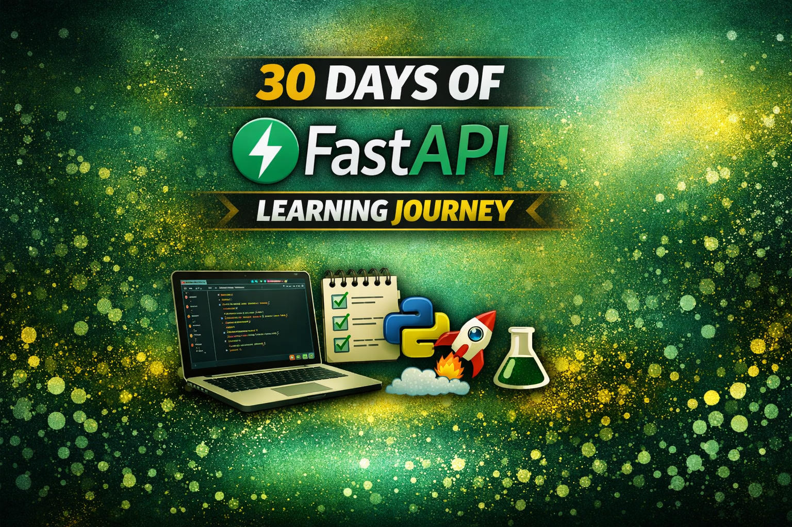

# FastAPI

This repo records my journey of learning FastAPI - from basic to deploying a project

I am undertaking this adventure of learing FastAPI and documenting my jouney here, in this repo. If you want to follow this path too, come along.

### I am using `Linux`. If your system have a different operating system, some commands may vary, but `python syntax` is same for every operating system. 

## Phase 1: Core Mechanics (Days 1–10) - Foundations
Focus: Mastering FastAPI's basics and type system for reliable development.

### Day 1: Environment Setup
- [day_01](day_01/)
### Day 2: Exploring Basics
- [day_02](day_02/)