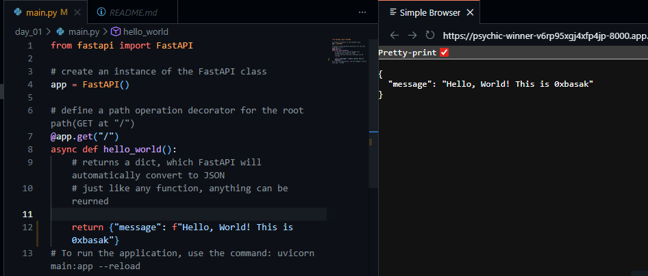
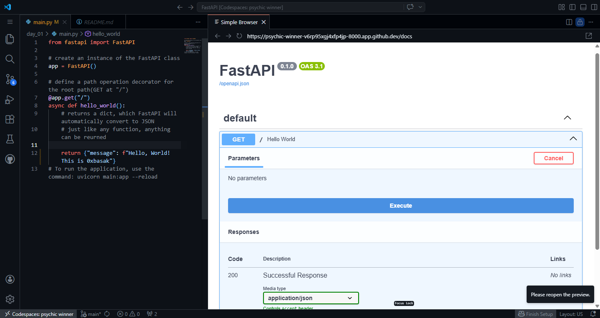

# Day 1: Environment Setup
- Install Python 3.10+ and set up a virtual environment.
- Install FastAPI and Uvicorn via pip.
- Create a basic "Hello World" FastAPI app.
- Run the app with Uvicorn and access /docs (Swagger UI) and /redoc.

## Details
- I already have `python` installed
- installing `FastApi` & `Uvicorn`
    - create a virtual environment [venv-python_docs](https://docs.python.org/3/library/venv.html), [venv-w3schools](https://www.w3schools.com/python/python_virtualenv.asp) 
    - run 
    ````bash
    python -m venv venv
    source venv/bin/activate
    pip install fastapi uvicorn
    ````
    - ``Uvicorn`` is a lightning-fast, lightweight ``ASGI`` (Asynchronous Server Gateway Interface) web server for Python, unlike `flask` which uses `WSGI` (Web Server Gateway Interface)
- creating first app
    - [main.py](main.py)
- run the app
````
uvicorn main:app --relaod
````
     main: Refers to the file main.py.

     app: Refers to the variable app = FastAPI() inside that file.

     --reload: Automatically restarts the server whenever it detects a change in code.



- exploe docs at `/docs` or `/redoc`. FastAPI generates these automatically.

