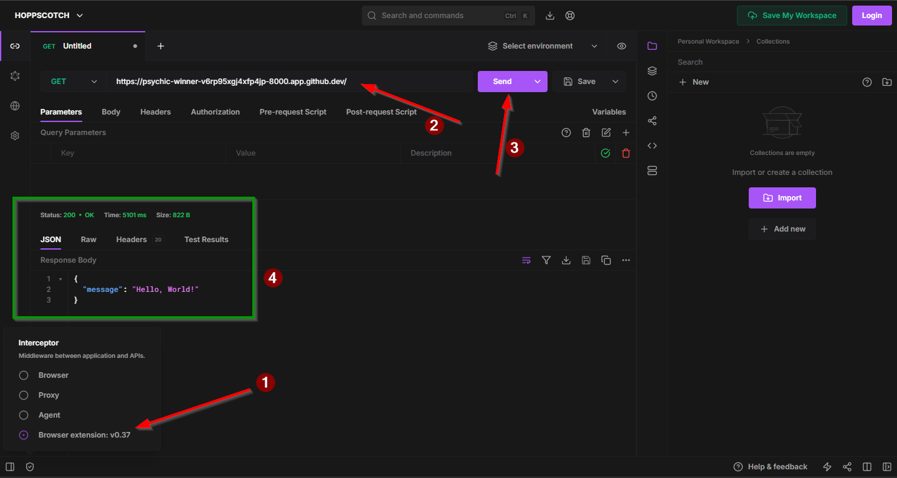
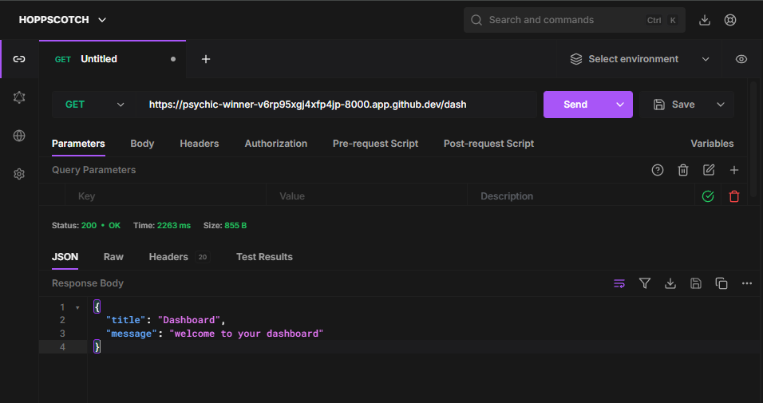
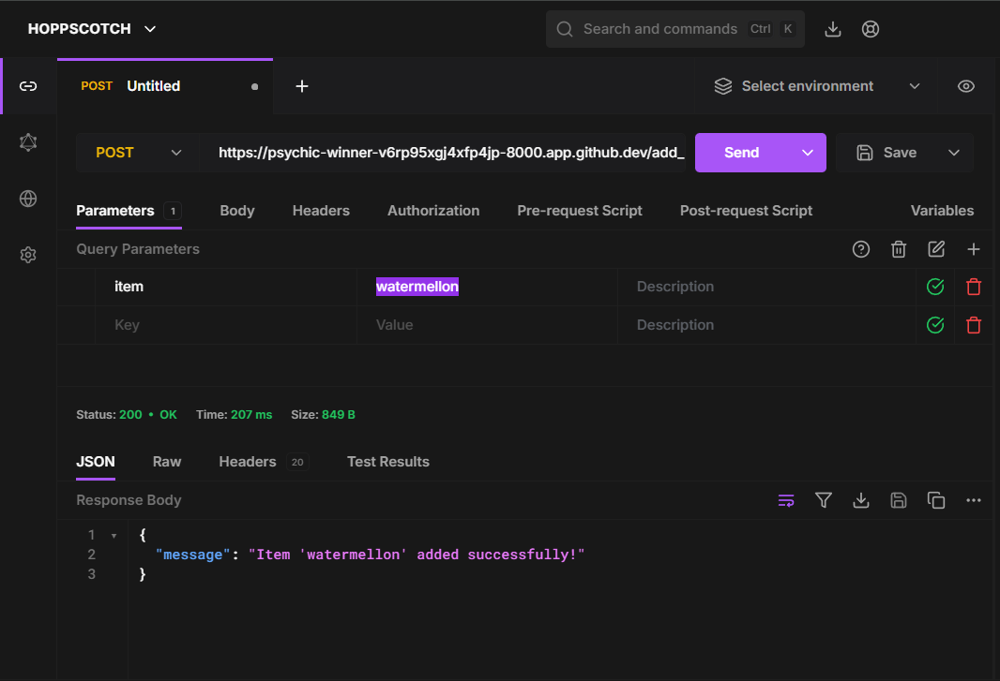

# Day 04
- HTTP methods
- use of hoppscotch (a `postman` alternative)

---
**Usually most people use `postman` to interact with the api. but I am using [Hoppscotch](https://hoppscotch.io/)**

learn about http methods here https://blog.postman.com/what-are-http-methods/

### To use hoppscotch ->
start the uvicorn server. feel free to use the given [code](main.py).

1. head over to [Hoppscotch](https://hoppscotch.io/)
2. install the browser extension to work with localhost.
3. select the extension from `interceptor` tab
4. paste your localhost link (I am using codespaces. If on localhost, the link should look like `https://127.0.0.1:8000`)
5. send the request (`GET` is default)
6. observe the response geting rendered on the screen

7. hit another endpoint(`/dash`) and watch it getting rendered


### POST
so far i've only used `get`. time for `post`
1. to process post, add `@app.post("/path")` like this
````python
@app.post("/add_items")
def add_items(item: str):
    # In a real application, you would typically add the item to a database or perform some other action here.
    return {"message": f"Item '{item}' added successfully!"}

````
in hoppscotch, add the parameters, hit send and observe the response
